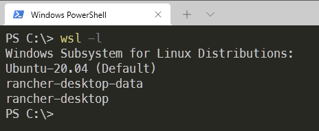
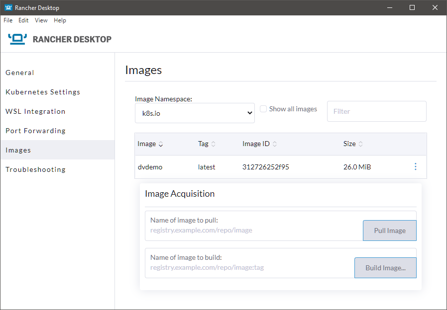
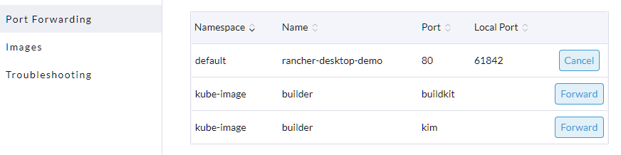

# Rancher Desktop Demo

I was looking for a way to easily run a kubernetes cluster on Windows and came across [Rancher Desktop](https://rancherdesktop.io/).

This repo is a way for me to write down how I did it and hopefully help other people who may be interested in doing something similar.

## Pre-Req's

### 1. Install Windows terminal

This is not really needed, but it makes working with kubernetes and the terminal a lot easier.

Go to: <https://github.com/microsoft/terminal>

and install following their instructions.

### 2. Install WSL 2

In order for Rancher Desktop to work, it spins up a WSL machine. To install WSL on windows, go to: [Install WSL](https://docs.microsoft.com/en-us/windows/wsl/install)

TLDR: Open Powershell Terminal as Admin and type:

``` bash
wsl --install
```

### 3. Install Rancher Desktop

Go to [Rancher Desktop](https://rancherdesktop.io/) and get their latest version. (At the time of this writing it is version 0.6.0)

> **Rancher Desktop for Linux is coming soon!**

## Working with Rancher Desktop

Rancher Desktop will install utilities to make working with kubernetes much easier and set everything up for you.  

Once the install process finishes, Run Rancher Desktop and open a terminal.  

To get a list of your current wsl machines, type:

``` bash
wsl -l
```

In the following screenshot I have Ubuntu and rancher-desktop running.  


> Note: Version 0.6.0 has `rancher-desktop-data` to enable auto updates, it has also moved away from using KIM to do the builds and now uses `nerdctl`

the rancher-desktop wsl machine uses [K3s](https://k3s.io/) to enable running and building of containers. You don't have to worry about the details since everything is setup for you by Rancher Desktop.

## Seeing what is running

Rancher Desktop installs and configures kubectl for you, which allows you to interact with the cluster.  

To see what is running type:

```bash
kubectl get all -A
```

You will get a list of currently running pods, services and deployments similar to:

```bash
PS C:\> kubectl get all -A
NAMESPACE     NAME                                          READY   STATUS      RESTARTS   AGE
kube-system   pod/metrics-server-86cbb8457f-cj9zz           1/1     Running     0          5m18s
kube-system   pod/local-path-provisioner-5ff76fc89d-hxzt7   1/1     Running     0          5m18s
kube-system   pod/coredns-7448499f4d-dp5qw                  1/1     Running     0          5m18s
kube-system   pod/helm-install-traefik-crd-dfxfr            0/1     Completed   0          5m18s
kube-system   pod/helm-install-traefik-98rhr                0/1     Completed   1          5m18s
kube-system   pod/svclb-traefik-4hwwk                       2/2     Running     0          4m53s
kube-system   pod/traefik-97b44b794-xlxn5                   1/1     Running     0          4m53s
kube-image    pod/builder-7hbrt                             2/2     Running     0          4m3s

NAMESPACE     NAME                     TYPE           CLUSTER-IP     EXTERNAL-IP     PORT(S)                         AGEdefault       service/kubernetes       ClusterIP      10.43.0.1      <none>          443/TCP                         5m33s
kube-system   service/kube-dns         ClusterIP      10.43.0.10     <none>          53/UDP,53/TCP,9153/TCP          5m28s
kube-system   service/metrics-server   ClusterIP      10.43.242.5    <none>          443/TCP                         5m27s
kube-system   service/traefik          LoadBalancer   10.43.89.63    172.29.237.52   80:31027/TCP,443:31005/TCP      4m53s
kube-image    service/builder          NodePort       10.43.50.172   <none>          1234:30696/TCP,1233:30536/TCP   4m3s

NAMESPACE     NAME                           DESIRED   CURRENT   READY   UP-TO-DATE   AVAILABLE   NODE SELECTOR                          AGE
kube-system   daemonset.apps/svclb-traefik   1         1         1       1            1           <none>                                 4m53s
kube-image    daemonset.apps/builder         1         1         1       1            1           node-role.kubernetes.io/builder=true   4m3s

NAMESPACE     NAME                                     READY   UP-TO-DATE   AVAILABLE   AGE
kube-system   deployment.apps/metrics-server           1/1     1            1           5m28s
kube-system   deployment.apps/local-path-provisioner   1/1     1            1           5m28s
kube-system   deployment.apps/coredns                  1/1     1            1           5m28s
kube-system   deployment.apps/traefik                  1/1     1            1           4m53s

NAMESPACE     NAME                                                DESIRED   CURRENT   READY   AGE
kube-system   replicaset.apps/metrics-server-86cbb8457f           1         1         1       5m18s
kube-system   replicaset.apps/local-path-provisioner-5ff76fc89d   1         1         1       5m18s
kube-system   replicaset.apps/coredns-7448499f4d                  1         1         1       5m18s
kube-system   replicaset.apps/traefik-97b44b794                   1         1         1       4m53s

NAMESPACE     NAME                                 COMPLETIONS   DURATION   AGE
kube-system   job.batch/helm-install-traefik-crd   1/1           23s        5m26s
kube-system   job.batch/helm-install-traefik       1/1           25s        5m26s
```

The interesting things to note here are the builder and traefik services.
We can use [traefik](https://traefik.io/) to get into the cluster and nerdctl leverages the builder service to build containers using [buildkit](https://github.com/moby/buildkit). Don't worry too much about the details of traefik, nerdctl and buildkit; it's just nice to know that they are doing their **magic** behind the scenes.  

## Building a container with nerdctl

Rancher Desktop now uses nerdctl to build containers, it is automatically configured for you when you install Rancher Desktop.  
I provided a sample Dockerfile in the `sample\container` folder that you can use.

cd to the `sample\container` folder and type:

```bash
nerdctl -n k8s.io build -t dvdemo:latest .
```

> Note: We add the `-n k8s.io` flag to get our image into the right namespace and make it available to the K8s cluster

you should get some output similar to:

```bash
 nerdctl -n k8s.io build -t dvdemo:latest .
[+] Building 4.1s (7/7) FINISHED
 => [internal] load build definition from Dockerfile                                                               0.0s
 => => transferring dockerfile: 98B                                                                                0.0s
 => [internal] load .dockerignore                                                                                  0.0s
 => => transferring context: 2B                                                                                    0.0s
 => [internal] load metadata for docker.io/library/nginx:alpine                                                    1.9s
 => [internal] load build context                                                                                  0.1s
 => => transferring context: 3.45kB                                                                                0.0s
 => [1/2] FROM docker.io/library/nginx:alpine@sha256:686aac2769fd6e7bab67663fd38750c135b72d993d0bb0a942ab02ef647f  1.1s
 => => resolve docker.io/library/nginx:alpine@sha256:686aac2769fd6e7bab67663fd38750c135b72d993d0bb0a942ab02ef647f  0.1s
 --- REMOVED TO REDUCE TEXT ---
 => [2/2] COPY index.html /usr/share/nginx/html/                                                                   0.1s
 => exporting to oci image format                                                                                  0.6s
 => => exporting layers                                                                                            0.2s
 => => exporting manifest sha256:dcb5094f802838df8652b635a5d8b6075058d21ce0f145aa341e18a6cdd9ada0                  0.0s
 => => exporting config sha256:6077cfd0223249cbc205dcbe44eb691942890240e41d397976e4fb8f3812680d                    0.0s
 => => sending tarball                                                                                             0.3s
unpacking docker.io/library/dvdemo:latest (sha256:dcb5094f802838df8652b635a5d8b6075058d21ce0f145aa341e18a6cdd9ada0)...done
unpacking overlayfs@sha256:dcb5094f802838df8652b635a5d8b6075058d21ce0f145aa341e18a6cdd9ada0 (sha256:dcb5094f802838df8652b635a5d8b6075058d21ce0f145aa341e18a6cdd9ada0)...done
```

You should now be able to see the newly created image in the cluster.  

Go to the Rancher Desktop UI and click on "Images" on the left side.  

It should look something similar to this:  


> Note: I had to use the drop down to switch to the `k8s.io` Image Namespace

## Creating a deployment, services and ingress

Creating a deployment, service and ingress is beyond the scope of this demo. I followed the article ["Replacing Docker Desktop with WSL2 and/or Rancher Desktop on Windows"](https://jason-umiker.medium.com/replacing-docker-desktop-with-wsl2-and-or-rancher-desktop-on-windows-5e036f9dc3a4) by Jason Umiker.

I included a sample deployment in the sample/deployment folder.  
I had to modify Jason's sample to include `imagePullPolicy: IfNotPresent` on line 18 to make it work with locally built container images.  

```yaml
- name: rancherDesktopDemo
  image: dvdemo:latest
  imagePullPolicy: IfNotPresent
```

to create the deployment, in a terminal cd to the sample deployment folder and type:

```bash
kubectl apply -f .\rancherDesktopDemo.yaml
```

the terminal should show something similar to:

```bash
deployment.apps/rancher-desktop-demo created
service/rancher-desktop-demo created
ingress.networking.k8s.io/rancher-desktop-demo created
```

## Accessing your newly created container

Part of the previous command creates an ingress into your cluster, to see it type:

```bash
kubectl get ingress
```

It will respond with something similar to:

```bash
NAME                   CLASS    HOSTS   ADDRESS        PORTS   AGE
rancher-desktop-demo   <none>   *       172.30.30.65   80      2m55s
```

Note the IP address, in this case `172.30.30.65`

Open a web browser and navigate to `http://172.30.30.65`, it should respond with something similar to:


## Creating a local port forward

If you want to be able to access the cluster locally, Rancher Desktop also enables port forwarding. Click on "Port Forwarding", then "Forward" under your chosen Name (in this case rancher-desktop-demo"). In the screenshot it is forwarding to local port `61842`


After enabling the port forward you should be able to navigate to `http://localhost:61842/` and see the same page that loaded for `http://172.30.30.65`.

## Conclusion and Next Steps

**That's it!** You now have a container running in your kubernetes cluster that is accessible on the cluster IP and on a local port forward.  Let me know if you have any questions. I can be reached at [@IAmDanielV](https://twitter.com/IAmDanielV).

## Adding Portainer

If you want a web based view of your Kubernetes cluster, you can install Portainer. It's a very powerful UI that gives you a lot of control over the cluster and lets you deploy things without having to mess around with command lines.

To learn more about Portainer go to [Portainer.io](https://www.portainer.io/)

This was really easy to deploy, I followed the instructions from [Portainer's Documentation](https://docs.portainer.io/v/ce-2.9/start/install/server/kubernetes/wsl#deployment)

Basically, you use Helm (installed for you by Rancher Desktop).

**Step 1:** Add the Helm Repo

```bash
helm repo add portainer https://portainer.github.io/k8s/
helm repo update
```

**Step 2:** Choose a way of accessing portainer.
I chose the "Expose via NodePort" method, but there are also instructions for doing it with ingress and Load Balancer. You can explore and choose the one that fits your use case best.

```bash
helm install --create-namespace -n portainer portainer portainer/portainer
```

Helm should respond with something similar to:

```bash
helm install --create-namespace -n portainer portainer portainer/portainer
NAME: portainer
NAMESPACE: portainer
STATUS: deployed
REVISION: 1
NOTES:
Get the application URL by running these commands:
  export NODE_PORT=$(kubectl get --namespace portainer -o jsonpath="{.spec.ports[1].nodePort}" services portainer)
  export NODE_IP=$(kubectl get nodes --namespace portainer -o jsonpath="{.items[0].status.addresses[0].address}")
  echo https://$NODE_IP:$NODE_PORT
```

the **export** command will not work on Windows, so I just ran the commands manually

```bash
# get port
kubectl get --namespace portainer -o jsonpath="{.spec.ports[1].nodePort}" services portainer

# get node IP
kubectl get nodes --namespace portainer -o jsonpath="{.items[0].status.addresses[0].address}"
```

in my case it returned 30779 for port and an IP.

**That's it!** Your portainer instance should be available at `https://IP:30779` or `https://localhost:30779/`

Portainer has a lot of features and is beyond the scope of this demo, but you can learn more at [Portainer.io](https://www.portainer.io/)

## Cleaning up

The kubernetes engine will keep the specified containers running. If you want to stop and free up some memory once you are done you can change to the `sample/deployment` folder and run:

```bash
kubectl delete -f .\rancherDesktopDemo.yaml
```

kubectl should respond with something similar to:

```bash
deployment.apps "rancher-desktop-demo" deleted
service "rancher-desktop-demo" deleted
ingress.networking.k8s.io "rancher-desktop-demo" deleted
```

Pods, services, and ingress should be cleaned up automatically.
